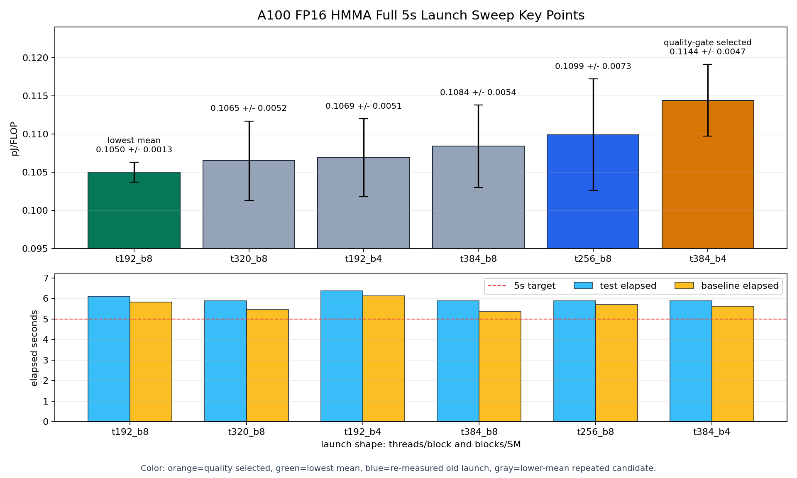
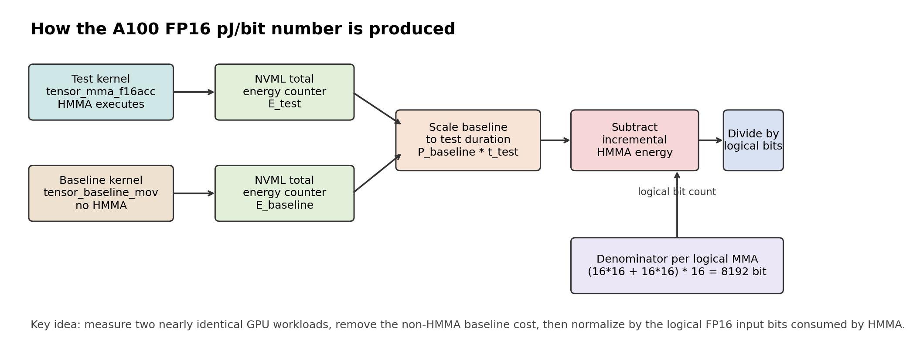

# A100 FP16 Tensor Core Energy Report

Date: 2026-06-03  
GPU: NVIDIA A100-SXM4-80GB, GA100, `sm_80`  
Canonical result directories:

- `../../../fp16_energy_impl/results/a100/fp16_full_sweep_a100_20260603_044813/`
- `../../../fp16_energy_impl/results/a100/fp16_matmul_pjbit_a100_20260603_031033/`
- `../../../fp16_energy_impl/results/a100/fp16_long_sweep_a100_20260603_034822/`

## Summary

The recommended A100 diagnostic value is the full planned 5-second launch-shape sweep selected point:

| Basis | Launch shape | Repeats | Result |
|---|---|---:|---:|
| Quality-gate selected saturation point | `threads=384`, `blocks/SM=4` | 5 | `0.1144 +/- 0.0047 pJ/FLOP` |
| Lowest mean diagnostic point | `threads=192`, `blocks/SM=8` | 5 | `0.1050 +/- 0.0013 pJ/FLOP` |
| Selected target work-slope | `threads=384`, `blocks/SM=4` | 5 work points | `0.1406 pJ/FLOP`, R2 `0.986` |
| Lowest mean work-slope | `threads=192`, `blocks/SM=8` | 5 work points | `0.1337 pJ/FLOP`, R2 `0.990` |
| Re-measured old fixed launch | `threads=256`, `blocks/SM=8` | 5 | `0.1099 +/- 0.0073 pJ/FLOP` |
| Original short fixed run | `threads=256`, `blocks/SM=8` | last 10 of 12 | `0.1469 +/- 0.0109 pJ/FLOP` |

The `0.1144 +/- 0.0047 pJ/FLOP` value is preferred because it comes from the full planned launch-shape sweep and uses the quality-gate first-saturation selection rule. The lower `t192_b8` point is kept as a diagnostic lower-mean point, but it is not the selected representative target.



## What Is Being Measured

The quantity is not DRAM pJ/bit. The reported unit is `pJ/FLOP` for the logical Tensor Core work:

```text
pJ/FLOP = (E_test - P_baseline * elapsed_test) / logical_FP16_FLOPs
```

Older generated fields and figures use names such as `matmul_input_pj_per_bit` because the first implementation used logical A/B input bits as the denominator. For this benchmark those two denominators are numerically identical for one logical `m16n16k16` MMA:

```text
A bits + B bits = (16*16 + 16*16) * 16 = 8192 bit
FLOPs          = 2 * 16 * 16 * 16       = 8192 FLOP
```

Therefore the historical `pJ/input-bit` column has the same numeric value as `pJ/FLOP` here. The `pJ/FLOP` name is preferred because the benchmark is a Tensor Core compute workload, not a memory-bit energy experiment.

The best name for the result is:

```text
logical m16n16k16 FP16 FLOP당 baseline-subtracted board/NVML energy estimate
```



## Baseline Subtraction

The test kernel is `tensor_mma_f16acc`. The structural baseline is `tensor_baseline_mov`. The baseline keeps the launch shape and register/synchronization structure close to the Tensor Core kernel while avoiding HMMA execution.

| Kernel | Role |
|---|---|
| `tensor_mma_f16acc` | FP16 Tensor Core HMMA workload |
| `tensor_baseline_mov` | structural no-HMMA baseline |

The subtraction removes much of the board/runtime/control overhead, but it does not isolate pure silicon arithmetic-unit energy.


## Why The 5-Second Sweep Replaced The 1,000,000-Iteration Fixed Run

The original fixed run used `iters=1,000,000`, `threads=256`, `blocks/SM=8`, and `unroll=8`. It was useful for proving that the A100 binary and NVML measurement path worked, but the windows were short:

| Metric | Original fixed run | Full 5s sweep |
|---|---:|---:|
| Test elapsed | about `1.47 s` | new `full5s` minimum `5.891 s` |
| Baseline elapsed | about `0.43 s` | new `full5s` minimum `5.461 s` |
| Minimum test power samples | `10` | at least tens of samples per row |
| Same `t256_b8` pJ/FLOP | `0.1469 +/- 0.0109` | `0.1099 +/- 0.0073` |

The shorter fixed run is therefore retained as a historical diagnostic, but the full 5-second sweep is the preferred comparison basis.

## 5-Second Sweep Design

| Field | Setting |
|---|---|
| `threads/block` | `32`, `64`, `96`, `128`, `160`, `192`, `224`, `256`, `288`, `320`, `384` |
| `blocks/SM` | `1`, `2`, `4`, `8` |
| total launch shapes | 44 |
| `unroll` | 8 |
| `warmup` | 2 |
| baseline repeats | 10 |
| output store | suppressed |
| sample interval | 100 ms |
| primary energy source | `NVML total energy counter` |

The sweep scales `iters` so each test interval exceeds 5 seconds. The full planned range has complete 44/44 launch-shape coverage. Decision-boundary candidates `t160_b8`, `t192_b4`, `t192_b8`, `t224_b8`, `t288_b8`, `t320_b8`, and `t384_b2`, plus existing `t256_b8`, `t384_b4`, and `t384_b8`, were repeated to five runs for confidence intervals around the selected target and lower-mean candidates.

## Full Planned Sweep Range

```text
threads/block: 32, 64, 96, 128, 160, 192, 224, 256, 288, 320, 384
blocks/SM:     1, 2, 4, 8
threads/SM:    32, 64, 96, 128, 160, 192, 224, 256, 288, 320, 384,
               512, 576, 640, 768, 896, 1024, 1152, 1280, 1536, 1792, 2048, 2304, 2560, 3072
logical shape: m16n16k16
input bits:    8192 bit/logical MMA
FLOPs:         8192 FLOP/logical MMA
```

The previous focused `3 x 4 = 12` A100 long-window run remains provenance for the first long-window result, but it is superseded for A100 launch-shape coverage by `fp16_full_sweep_a100_20260603_044813`.

## Selected Sweep Results

| Launch | Repeats | Test s | Baseline s | TFLOPS | Tensor model util | pJ/FLOP | Interpretation |
|---|---:|---:|---:|---:|---:|---:|---|
| `t192_b8` | 5 | 6.118 | 5.822 | 296.19 | 94.97% | `0.1050 +/- 0.0013` | lowest mean diagnostic |
| `t320_b8` | 5 | 5.891 | 5.461 | 307.57 | 98.62% | `0.1065 +/- 0.0052` | lower-mean repeated candidate |
| `t192_b4` | 5 | 6.364 | 6.139 | 284.73 | 91.30% | `0.1069 +/- 0.0051` | lower-mean repeated candidate |
| `t384_b8` | 5 | 5.879 | 5.355 | 308.18 | 98.82% | `0.1084 +/- 0.0054` | lower-mean repeated candidate |
| `t256_b8` | 5 | 5.897 | 5.706 | 307.26 | 98.52% | `0.1099 +/- 0.0073` | re-measured old launch |
| `t384_b4` | 5 | 5.884 | 5.628 | 307.95 | 98.74% | `0.1144 +/- 0.0047` | quality-gate selected |

The quality gate selects `t384_b4`, not the absolute lowest pJ/FLOP point, because the selection rule is the first Tensor Core model-utilization saturation point among valid candidates.

## Full Sweep Execution Table

This table lists every A100 full planned sweep launch shape that was run and analyzed. The same table is available as CSV and XLSX:

- `A100_FP16_FULL_SWEEP_TABLE.csv`
- `A100_FP16_FULL_SWEEP_TABLE.xlsx`

| Launch | Threads/block | Blocks/SM | Threads/SM | Runs | Test s | Baseline s | TFLOPS | Tensor util % | pJ/FLOP | CI95 | Selected | Selection status |
| --- | --- | --- | --- | --- | --- | --- | --- | --- | --- | --- | --- | --- |
| t32_b1 | 32 | 1 | 32 | 1 | 35.601 | 112.611 | 50.90 | 16.32 | 0.1836 | 0.0000 |  | valid_no_l2_not_selected |
| t32_b2 | 32 | 2 | 64 | 1 | 17.802 | 56.310 | 101.79 | 32.64 | 0.1842 | 0.0000 |  | valid_no_l2_not_selected |
| t32_b4 | 32 | 4 | 128 | 1 | 8.904 | 28.153 | 203.50 | 65.25 | 0.1876 | 0.0000 |  | valid_no_l2_not_selected |
| t32_b8 | 32 | 8 | 256 | 1 | 6.745 | 14.759 | 268.64 | 86.14 | 0.1660 | 0.0000 |  | valid_no_l2_not_selected |
| t64_b1 | 64 | 1 | 64 | 1 | 17.801 | 56.311 | 101.79 | 32.64 | 0.1830 | 0.0000 |  | valid_no_l2_not_selected |
| t64_b2 | 64 | 2 | 128 | 1 | 8.903 | 28.152 | 203.52 | 65.26 | 0.1800 | 0.0000 |  | valid_no_l2_not_selected |
| t64_b4 | 64 | 4 | 256 | 1 | 6.741 | 14.760 | 268.80 | 86.19 | 0.1727 | 0.0000 |  | valid_no_l2_not_selected |
| t64_b8 | 64 | 8 | 512 | 1 | 6.389 | 7.720 | 283.61 | 90.94 | 0.1305 | 0.0000 |  | valid_no_l2_not_selected |
| t96_b1 | 96 | 1 | 96 | 1 | 11.867 | 37.537 | 152.68 | 48.96 | 0.1926 | 0.0000 |  | valid_no_l2_not_selected |
| t96_b2 | 96 | 2 | 192 | 1 | 8.932 | 19.675 | 202.85 | 65.04 | 0.1818 | 0.0000 |  | valid_no_l2_not_selected |
| t96_b4 | 96 | 4 | 384 | 1 | 6.608 | 10.062 | 274.19 | 87.92 | 0.1500 | 0.0000 |  | valid_no_l2_not_selected |
| t96_b8 | 96 | 8 | 768 | 1 | 6.233 | 6.710 | 290.68 | 93.21 | 0.1207 | 0.0000 |  | valid_no_l2_not_selected |
| t128_b1 | 128 | 1 | 128 | 1 | 8.907 | 28.166 | 203.42 | 65.23 | 0.1826 | 0.0000 |  | valid_no_l2_not_selected |
| t128_b2 | 128 | 2 | 256 | 1 | 6.702 | 14.761 | 270.37 | 86.69 | 0.1771 | 0.0000 |  | valid_no_l2_not_selected |
| t128_b4 | 128 | 4 | 512 | 1 | 6.390 | 7.682 | 283.56 | 90.92 | 0.1382 | 0.0000 |  | valid_no_l2_not_selected |
| t128_b8 | 128 | 8 | 1024 | 1 | 6.144 | 6.985 | 294.93 | 94.57 | 0.1273 | 0.0000 |  | valid_no_l2_not_selected |
| t160_b1 | 160 | 1 | 160 | 1 | 9.682 | 23.612 | 187.14 | 60.01 | 0.1982 | 0.0000 |  | valid_no_l2_not_selected |
| t160_b2 | 160 | 2 | 320 | 1 | 8.219 | 11.989 | 220.44 | 70.69 | 0.1348 | 0.0000 |  | valid_no_l2_not_selected |
| t160_b4 | 160 | 4 | 640 | 1 | 6.464 | 6.346 | 280.32 | 89.88 | 0.1104 | 0.0000 |  | valid_no_l2_not_selected |
| t160_b8 | 160 | 8 | 1280 | 5 | 6.174 | 6.240 | 293.49 | 94.11 | 0.1094 | 0.0042 |  | valid_no_l2_not_selected |
| t192_b1 | 192 | 1 | 192 | 1 | 8.067 | 19.677 | 224.61 | 72.02 | 0.1891 | 0.0000 |  | valid_no_l2_not_selected |
| t192_b2 | 192 | 2 | 384 | 1 | 6.850 | 9.990 | 264.52 | 84.82 | 0.1649 | 0.0000 |  | valid_no_l2_not_selected |
| t192_b4 | 192 | 4 | 768 | 5 | 6.364 | 6.139 | 284.73 | 91.30 | 0.1069 | 0.0051 |  | valid_no_l2_not_selected |
| t192_b8 | 192 | 8 | 1536 | 5 | 6.118 | 5.822 | 296.19 | 94.97 | 0.1050 | 0.0013 |  | valid_no_l2_not_selected |
| t224_b1 | 224 | 1 | 224 | 1 | 6.914 | 16.863 | 262.05 | 84.03 | 0.1979 | 0.0000 |  | valid_no_l2_not_selected |
| t224_b2 | 224 | 2 | 448 | 1 | 6.811 | 8.562 | 266.03 | 85.30 | 0.1418 | 0.0000 |  | valid_no_l2_not_selected |
| t224_b4 | 224 | 4 | 896 | 1 | 6.291 | 6.637 | 288.01 | 92.35 | 0.1237 | 0.0000 |  | valid_no_l2_not_selected |
| t224_b8 | 224 | 8 | 1792 | 5 | 6.082 | 5.907 | 297.93 | 95.53 | 0.1097 | 0.0026 |  | valid_no_l2_not_selected |
| t256_b1 | 256 | 1 | 256 | 1 | 6.053 | 14.759 | 299.35 | 95.98 | 0.2022 | 0.0000 |  | valid_no_l2_not_selected |
| t256_b2 | 256 | 2 | 512 | 1 | 5.961 | 7.379 | 303.96 | 97.46 | 0.1475 | 0.0000 |  | valid_no_l2_not_selected |
| t256_b4 | 256 | 4 | 1024 | 1 | 5.919 | 6.500 | 306.12 | 98.16 | 0.1275 | 0.0000 |  | valid_no_l2_not_selected |
| t256_b8 | 256 | 8 | 2048 | 5 | 5.897 | 5.706 | 307.26 | 98.52 | 0.1099 | 0.0073 |  | valid_no_l2_not_selected |
| t288_b1 | 288 | 1 | 288 | 1 | 7.880 | 13.118 | 229.94 | 73.73 | 0.1811 | 0.0000 |  | valid_no_l2_not_selected |
| t288_b2 | 288 | 2 | 576 | 1 | 6.606 | 6.960 | 274.27 | 87.94 | 0.1300 | 0.0000 |  | valid_no_l2_not_selected |
| t288_b4 | 288 | 4 | 1152 | 1 | 5.914 | 6.570 | 306.40 | 98.25 | 0.1328 | 0.0000 |  | valid_no_l2_not_selected |
| t288_b8 | 288 | 8 | 2304 | 5 | 5.893 | 5.569 | 307.46 | 98.59 | 0.1098 | 0.0025 |  | valid_no_l2_not_selected |
| t320_b1 | 320 | 1 | 320 | 1 | 7.091 | 11.806 | 255.53 | 81.93 | 0.1721 | 0.0000 |  | valid_no_l2_not_selected |
| t320_b2 | 320 | 2 | 640 | 1 | 5.944 | 6.264 | 304.84 | 97.74 | 0.1318 | 0.0000 |  | valid_no_l2_not_selected |
| t320_b4 | 320 | 4 | 1280 | 1 | 5.909 | 6.205 | 306.66 | 98.33 | 0.1253 | 0.0000 |  | valid_no_l2_not_selected |
| t320_b8 | 320 | 8 | 2560 | 5 | 5.891 | 5.461 | 307.57 | 98.62 | 0.1065 | 0.0052 |  | valid_no_l2_not_selected |
| t384_b1 | 384 | 1 | 384 | 1 | 5.912 | 9.689 | 306.49 | 98.27 | 0.1843 | 0.0000 |  | valid_no_l2_not_selected |
| t384_b2 | 384 | 2 | 768 | 5 | 5.892 | 5.771 | 307.52 | 98.61 | 0.1154 | 0.0054 |  | valid_no_l2_not_selected |
| t384_b4 | 384 | 4 | 1536 | 5 | 5.884 | 5.628 | 307.95 | 98.74 | 0.1144 | 0.0047 | yes | selected_valid_no_l2_saturation_point |
| t384_b8 | 384 | 8 | 3072 | 5 | 5.879 | 5.355 | 308.18 | 98.82 | 0.1084 | 0.0054 |  | valid_no_l2_not_selected |

## Work-Slope Checks

| Basis | Launch | Work points | Slope | R2 | Status |
|---|---|---:|---:|---:|---|
| Selected target | `t384_b4` | 5 | `0.1406 pJ/FLOP` | `0.986` | positive slope |
| Lowest mean diagnostic | `t192_b8` | 5 | `0.1337 pJ/FLOP` | `0.990` | positive slope |

These work-slope sweeps varied `unroll = 1, 2, 4, 8, 16` at fixed `iters=2,000,000`, using the same `tensor_mma_f16acc` / `tensor_baseline_mov` pair. They are a consistency check that incremental energy increases with logical work; they do not replace the launch-shape sweep values above.

## Audit Summary

| Check | Status |
|---|---|
| A100 `sm_80` build/run | PASS |
| full planned sweep coverage | PASS, 44/44 launch shapes |
| full sweep timing | PASS, new `full5s` tests minimum `5.891 s` |
| decision-boundary repeats | PASS, selected/lower-mean candidates at 5 runs |
| current benchmark schema | PASS, `fp16-energy-bench-v2` |
| denominator metadata | PASS, `8192` FLOP/logical MMA; legacy input-bit denominator is also `8192` |
| intended timed global/L2 memory metadata | PASS, no intended memory |
| NVML total energy counter | PASS |
| clock stability | PASS, `1410 MHz`, span `0 MHz` |
| selected/lowest work-slope | PASS, positive slope and R2 >= 0.80 |
| NCU hardware counter validation | BLOCKED by `ERR_NVGPUCTRPERM` |

## NCU / Vast.ai Limitation

Root/sudo execution still failed with:

```text
ERR_NVGPUCTRPERM - The user does not have permission to access NVIDIA GPU Performance Counters
```

The Vast.ai container exposes `RmProfilingAdminOnly: 1` and lacks the capability needed for GPU performance counters. Therefore HMMA activity, L2 bytes, DRAM bytes, and local spill counters are not validated. This remains a diagnostic NVML-counter estimate.

## Reproduction Artifacts

| Artifact | Path |
|---|---|
| full-sweep report source | `../../../fp16_energy_impl/results/a100/fp16_full_sweep_a100_20260603_044813/` |
| full-sweep summary | `../../../fp16_energy_impl/results/a100/fp16_full_sweep_a100_20260603_044813/thread_sweep_summary.csv` |
| full-sweep quality gate summary | `../../../fp16_energy_impl/results/a100/fp16_full_sweep_a100_20260603_044813/quality_gate_summary.json` |
| selected target work-slope | `../../../fp16_energy_impl/results/a100/fp16_full_sweep_a100_20260603_044813/work_slope_selected/work_slope_summary.csv` |
| lowest mean work-slope | `../../../fp16_energy_impl/results/a100/fp16_full_sweep_a100_20260603_044813/work_slope_lowest_t192_b8/work_slope_summary.csv` |
| fixed-run report source | `../../../fp16_energy_impl/results/a100/fp16_matmul_pjbit_a100_20260603_031033/` |
| prior focused long-sweep source | `../../../fp16_energy_impl/results/a100/fp16_long_sweep_a100_20260603_034822/` |
