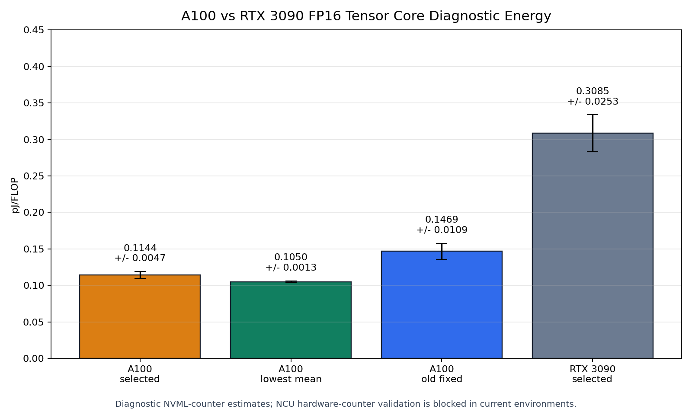

# FP16 A100 vs RTX 3090 Comparison

This document compares the current A100 and RTX 3090 FP16 Tensor Core diagnostic estimates. Both use logical `m16n16k16` FP16 FLOPs and structural baseline subtraction. Older generated columns may say `pJ/bit`; for this benchmark the logical A/B input-bit denominator and FLOP denominator are both `8192` per logical MMA, so the numeric values are identical and are reported here as `pJ/FLOP`.

## Main Comparison

| GPU / 기준 | Launch shape | pJ/FLOP | Relative to RTX3090 selected | Status |
|---|---|---:|---:|---|
| A100 quality selected | `threads=384`, `blocks/SM=4` | `0.1144 +/- 0.0047` | `2.70x` lower | 5s diagnostic selected target |
| A100 lowest mean | `threads=192`, `blocks/SM=8` | `0.1050 +/- 0.0013` | `2.94x` lower | lower mean, not selected representative |
| A100 old fixed run | `threads=256`, `blocks/SM=8` | `0.1469 +/- 0.0109` | `2.10x` lower | historical short-window diagnostic |
| RTX 3090 selected | `threads=256`, `blocks/SM=1` | `0.3085 +/- 0.0253` | baseline | strict-like diagnostic, NCU blocked |

## Why A100 Is Lower

The A100 result is lower mainly because:

1. GA100 has more SMs and higher FP16 Tensor Core throughput than GA102.
2. The A100 run maintained stable `1410 MHz` clock with `0 MHz` span.
3. The long sweep used intervals above 5 seconds, reducing fixed overhead and sampling-window error.
4. The selected A100 point achieved about 308 TFLOPS, while the RTX 3090 selected point achieved about 159 TFLOPS.

## Why The Numbers Are Still Diagnostic

Both environments block Nsight Compute performance counters with `ERR_NVGPUCTRPERM`. Therefore the following are not proven by hardware counters:

| Evidence | Status |
|---|---|
| HMMA instruction/activity counter | unavailable |
| L2 traffic counter | unavailable |
| DRAM traffic counter | unavailable |
| local spill counter | unavailable |
| physical zero-L2 proof | unavailable |

The benchmark metadata says the timed kernels have no intended global/L2 memory operation, but metadata is not the same as hardware-counter proof.

## H100 And Power API Caution

A100 and H100 can expose similarly named power telemetry fields such as `power.draw`, `power.draw.average`, or NVML energy/power APIs. The names do not guarantee identical behavior. Hopper/H100 has different architecture and potentially different smoothing/window semantics from Ampere/A100. H100 comparisons must therefore be run and validated separately, with HMMA/WGMMA path behavior made explicit.

## Canonical Source Documents

- [A100 FP16 energy report](A100_FP16_ENERGY_REPORT.md)
- [RTX 3090 FP16 results](RTX3090_FP16_RESULTS.md)
- [FP16 experiment index](README.md)
