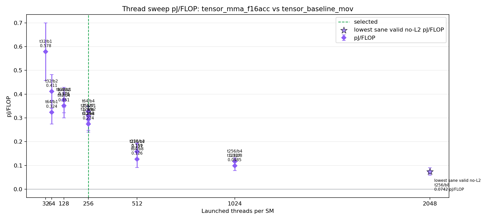

# RTX 3090 FP16 Tensor Core Results

Date: 2026-06-02  
GPU: NVIDIA GeForce RTX 3090, GA102, `sm_86`

This document consolidates the RTX 3090 FP16 Tensor Core result Markdown files that previously lived only inside individual `results/` run directories.

## Summary

The best RTX 3090 comparison point is the strict-like calibrated diagnostic run:

| Run | Launch shape | TFLOPS | pJ/FLOP | Status |
|---|---|---:|---:|---|
| `strict_fp16_launch_shape_rtx3090_20260602_115550` | `threads=256`, `blocks/SM=1` | 159.148 | `0.3085 +/- 0.0253` | strict-like diagnostic, NCU blocked |
| `diagnostic_fp16_launch_shape_rtx3090_20260602_125100` | `threads=256`, `blocks/SM=1` | 159.825 | `0.1833 +/- 0.1084` | no-NCU diagnostic, strict target not selected |
| `strict_fp16_launch_shape_rtx3090_20260602_124900` | none | n/a | n/a | strict pipeline stopped at NCU permission probe |

None of these are final strict hardware-counter claims. Nsight Compute performance-counter access was blocked by `ERR_NVGPUCTRPERM`.



## Strict-Like Calibrated Diagnostic Run

Result directory:

```text
../../../fp16_energy_impl/results/rtx3090/strict_fp16_launch_shape_rtx3090_20260602_115550/
```

| Field | Value |
|---|---:|
| test kernel | `tensor_mma_f16acc` |
| baseline kernel | `tensor_baseline_mov` |
| logical denominator | `m16n16k16`, `8192` FLOP/logical MMA; legacy input-bit denominator is also `8192` |
| output stores | suppressed in timed loop |
| threads/block sweep | `32`, `64`, `128`, `256` |
| blocks/SM sweep | `1`, `2`, `4`, `8` |
| repeats | 10 per launch shape |
| selected target | `threads=256`, `blocks/SM=1`, `threads/SM=256` |
| Tensor model utilization | 98.3395% |
| TFLOPS | 159.148 |
| pJ/FLOP | `0.308459` |
| valid no-L2 metadata | 10/10 |
| NCU validation | failed/missing due counter permission |

Lowest pJ/FLOP diagnostic candidate in that run was `threads=256`, `blocks/SM=8`, `threads/SM=2048`, with `0.074226 pJ/FLOP`. It is not used as the representative selected point because the selection rule prioritizes the first utilization saturation point, and NCU validation is unavailable.

The broader planned architecture-comparison sweep range is `threads/block = 32, 64, 96, 128, 160, 192, 224, 256, 288, 320, 384` crossed with `blocks/SM = 1, 2, 4, 8`. This RTX 3090 strict-like run covered the narrower subset available in the completed artifact, `threads/block = 32, 64, 128, 256`. Therefore it is useful as the current RTX 3090 comparison baseline, but it should not be described as having exhausted the full planned sweep range.

## No-NCU Diagnostic Sweep

Result directory:

```text
../../../fp16_energy_impl/results/rtx3090/diagnostic_fp16_launch_shape_rtx3090_20260602_125100/
```

This run explicitly skipped NCU. Its diagnostic selected point was again `threads=256`, `blocks/SM=1`, `threads/SM=256`:

| Metric | Value |
|---|---:|
| SM util | 99.4% |
| Tensor model util | 98.37% |
| TFLOPS | 159.82 |
| pJ/FLOP | `0.1833 +/- 0.1084` |
| valid no-L2 metadata | 5/10 |

`quality_gate.py` did not produce a strict selected target. `selected_targets` was empty and `selected_diagnostics` contained the point with `quality_pass=false`, `target_pass=false`, and `measurement_grade=mixed_or_unavailable`.

## Strict Pipeline Attempt Stopped At NCU Probe

Result directory:

```text
../../../fp16_energy_impl/results/rtx3090/strict_fp16_launch_shape_rtx3090_20260602_124900/
```

The strict pipeline passed preflight, architecture check, build, and ptxas resource checks, then stopped at the NCU permission probe:

```text
status=permission_denied
permission_probe_pass=false
permission_denied=true
fail_reasons=ncu returned 1; Nsight Compute performance counters are blocked by ERR_NVGPUCTRPERM; Nsight Compute did not profile any kernels
```

This is a host/driver/admin policy issue, not a CUDA build issue.

## Claim Boundary

The RTX 3090 result should be described as:

```text
RTX 3090 GA102 logical m16n16k16 FP16 FLOP당
baseline-subtracted NVML energy diagnostic estimate
```

Older generated fields and figure names may still say `pjbit` or `matmul_input_pj_per_bit`; for this benchmark those values are numerically identical to `pJ/FLOP` because the logical input-bit and FLOP denominators are both `8192` per logical MMA.

It should not be described as DRAM pJ/bit, L2 pJ/bit, or pure Tensor Core silicon energy.
