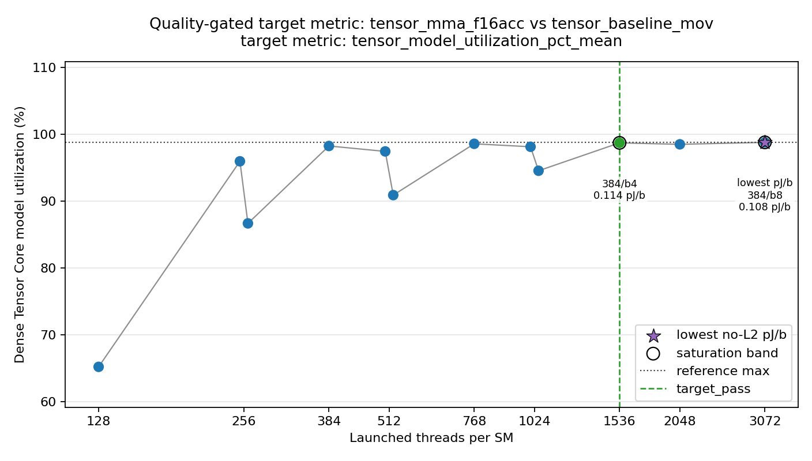

# A100 FP16 Tensor Core 5초 Sweep 실험 보고서

작성일: 2026-06-03  
결과 디렉터리: `results/fp16_long_sweep_a100_20260603_034822`  
대상 GPU: NVIDIA A100-SXM4-80GB, GA100, `sm_80`

## 1. 결론

기존 `iters=1,000,000` fixed-condition run은 test가 약 `1.47 s`, baseline이 약 `0.43 s`라서 baseline subtraction과 power API sampling window mismatch에 취약했다. 이를 보완하기 위해 `threads/block`과 `blocks/SM`을 sweep하고, 각 test/baseline 측정 구간이 모두 5초 이상이 되도록 work amount를 늘려 다시 측정했다.

최종적으로 기록할 A100 FP16 HMMA diagnostic 값은 다음과 같다.

| 기준 | Launch shape | 반복 | 결과 |
|---|---:|---:|---:|
| Quality-gate selected saturation point | `t384_b4` | 5회 | `0.1144 +/- 0.0047 pJ/bit` |
| Lowest mean diagnostic point | `t384_b8` | 5회 | `0.1084 +/- 0.0054 pJ/bit` |
| 기존 fixed launch 재측정 | `t256_b8` | 5회 | `0.1099 +/- 0.0073 pJ/bit` |

`quality_gate.py`는 `t384_b4`를 선택했다. 선택 이유는 pJ/bit 최저점이 아니라, Tensor model utilization이 포화되는 첫 지점을 선택하는 rule 때문이다. `t384_b8`은 평균 pJ/bit가 더 낮지만, 더 큰 resident work point라서 first-saturation selection rule에서는 대표 target이 아니다.


## 2. 왜 sweep과 5초 이상 측정이 필요했나

`pJ/bit`은 큰 두 에너지 값을 뺀 뒤 작은 차이를 bit 수로 나누는 값이다.

```text
P_baseline = E_baseline / t_baseline
E_incremental = E_test - P_baseline * t_test
pJ/bit = E_incremental / logical_FP16_input_bits * 1e12
```

이 방식은 baseline 평균 power가 정확해야 한다. 기존 fixed run의 baseline은 평균 `0.428 s`였고, 최소 baseline power sample 수가 `3`개뿐이었다. 이 정도 길이는 NVML total energy counter 자체에는 충분할 수 있지만, `nvidia-smi` power trace와의 window alignment, power state settling, baseline 평균 power 추정에는 짧다.

이번 sweep에서는 다음 기준을 적용했다.

| 항목 | 설정 |
|---|---:|
| `threads/block` | `128`, `256`, `384` |
| `blocks/SM` | `1`, `2`, `4`, `8` |
| 총 launch shape | 12개 |
| `unroll` | 8 |
| `warmup` | 2 |
| `suppress_output_store` | true |
| baseline kernel | `tensor_baseline_mov` |
| test kernel | `tensor_mma_f16acc` |
| baseline repeats | 10 |
| sampling interval | 100 ms |
| NCU validation | vast.ai `ERR_NVGPUCTRPERM`으로 불가 |

각 launch shape에서 test가 대략 5.9초가 되도록 `iters`를 조정했고, baseline은 `repeats=10`으로 누적 시간을 키웠다.

## 3. 실행 검수

최종 raw run은 `48`개다. 구성은 initial 12-condition sweep 24개 run에, 결정에 필요한 `t256_b8`, `t384_b4`, `t384_b8` 조건의 추가 반복 run을 append한 것이다.

| 검수 항목 | 결과 |
|---|---:|
| pair rows | 24 |
| thread sweep rows | 12 |
| quality pass rows | 36 |
| target pass rows | 1 |
| test elapsed minimum | `5.878 s` |
| baseline elapsed minimum | `5.353 s` |
| test power sample minimum | `45` |
| baseline power sample minimum | `41` |
| test counter/trace ratio range | `0.988` - `1.010` |
| baseline counter/trace ratio range | `0.985` - `1.010` |
| clock span | `0 MHz` |

이 검수 결과로 보면, 사용자가 지적한 `1.47 s` 문제는 해결됐다. 모든 test와 baseline pair가 5초 이상이며, power sample 수도 최소 41개 이상이다.

## 4. Sweep 결과

| Launch | n | Threads | Blocks/SM | Threads/SM | Test s | Baseline s | TFLOPS | Util | pJ/bit | 해석 |
|---|---:|---:|---:|---:|---:|---:|---:|---:|---:|---|
| `t384_b8` | 5 | `384` | `8` | 3072 | 5.879 | 5.355 | 308.18 | 98.82% | `0.1084 +/- 0.0054` | lowest mean |
| `t384_b2` | 1 | `384` | `2` | 768 | 5.892 | 5.770 | 307.51 | 98.60% | `0.1097` | single scan |
| `t256_b8` | 5 | `256` | `8` | 2048 | 5.897 | 5.706 | 307.26 | 98.52% | `0.1099 +/- 0.0073` | 5-repeat validation |
| `t384_b4` | 5 | `384` | `4` | 1536 | 5.884 | 5.628 | 307.95 | 98.74% | `0.1144 +/- 0.0047` | quality selected |
| `t128_b8` | 1 | `128` | `8` | 1024 | 6.144 | 6.985 | 294.93 | 94.57% | `0.1273` | single scan |
| `t256_b4` | 1 | `256` | `4` | 1024 | 5.919 | 6.500 | 306.12 | 98.16% | `0.1275` | single scan |
| `t128_b4` | 1 | `128` | `4` | 512 | 6.390 | 7.682 | 283.56 | 90.92% | `0.1382` | single scan |
| `t256_b2` | 1 | `256` | `2` | 512 | 5.961 | 7.379 | 303.96 | 97.46% | `0.1475` | single scan |
| `t128_b2` | 1 | `128` | `2` | 256 | 6.702 | 14.761 | 270.37 | 86.69% | `0.1771` | single scan |
| `t128_b1` | 1 | `128` | `1` | 128 | 8.907 | 28.166 | 203.42 | 65.23% | `0.1826` | single scan |
| `t384_b1` | 1 | `384` | `1` | 384 | 5.912 | 9.689 | 306.49 | 98.27% | `0.1843` | single scan |
| `t256_b1` | 1 | `256` | `1` | 256 | 6.053 | 14.759 | 299.35 | 95.98% | `0.2022` | single scan |

위 표에서 `t384_b2`는 평균 pJ/bit가 낮지만 1회 scan point라서 error bar가 없다. 의사결정에 중요한 세 조건인 `t256_b8`, `t384_b4`, `t384_b8`만 5회 반복했다. 전체 12개 조건 모두에 같은 수준의 CI가 필요하면 나머지 9개 조건도 추가 반복해야 한다.

Quality-gate figure도 함께 생성됐다.



## 5. 기존 1,000,000회 fixed run과 비교

| 항목 | 기존 fixed `t256_b8` | 이번 long `t256_b8` |
|---|---:|---:|
| 반복 | 12회, 안정 구간 마지막 10회 사용 | 5회 |
| test elapsed | `1.474 s` | `5.897 s` |
| baseline elapsed | `0.428 s` | `5.706 s` |
| 최소 test samples | `10` | `>= 45` |
| 최소 baseline samples | `3` | `>= 41` |
| counter/trace ratio, test | `1.007` | `0.999` |
| counter/trace ratio, baseline | `0.945` | `0.995` |
| incremental energy fraction | `0.257` | `0.195` |
| pJ/bit | `0.1469 +/- 0.0109` | `0.1099 +/- 0.0073` |

결론적으로 `1,000,000 iterations`는 kernel이 정상적으로 Tensor Core path를 밟고 대략적인 diagnostic estimate를 얻는 데는 충분했지만, baseline subtraction을 엄격하게 안정화하기에는 짧았다. 같은 `t256_b8` launch shape를 5초 이상으로 늘리면 pJ/bit이 기존 안정 구간보다 약 `1.34x` 낮아졌다. 따라서 기존 `0.1469 pJ/bit`은 보수적으로 높게 나온 short-window diagnostic 값으로 기록하고, A100 비교에는 이번 5초 sweep 값을 우선 사용하는 것이 맞다.

## 6. RTX 3090과 비교

기존 RTX3090 selected diagnostic 값은 `0.3085 +/- 0.0253 pJ/bit`이었다. 이번 A100 5초 sweep과 비교하면 다음과 같다.

| GPU / 기준 | pJ/bit | 비교 |
|---|---:|---:|
| A100 quality selected `t384_b4` | `0.1144 +/- 0.0047` | RTX3090 selected 대비 `2.70x` 낮음 |
| A100 lowest mean `t384_b8` | `0.1084 +/- 0.0054` | RTX3090 selected 대비 `2.85x` 낮음 |
| RTX3090 selected | `0.3085 +/- 0.0253` | 기존 기준 |

이 차이는 GA100 datacenter GPU의 높은 Tensor Core 처리량, 108개 SM, 안정적인 `1410 MHz` clock, 그리고 5초 이상 측정으로 fixed overhead와 sampling mismatch가 줄어든 효과가 결합된 결과로 해석된다.

## 7. H100 및 power measurement API 주의

A100과 H100은 `power.draw` 또는 NVML power 관련 API 이름이 같아 보일 수 있다. 그러나 같은 이름이 같은 동작을 뜻하지는 않는다. Hopper/H100은 아키텍처도 다르고, power smoothing과 telemetry window semantics도 Ampere/A100과 다를 수 있다. 따라서 이번 A100 결과를 H100의 FP16/HMMA/WGMMA energy로 그대로 옮기면 안 된다.

이번 보고서의 값은 다음으로 제한해서 해석해야 한다.

```text
A100 GA100에서 logical m16n16k16 FP16 input bit당
baseline-subtracted NVML total energy counter 기반 diagnostic pJ/bit
```

## 8. 한계

가장 큰 한계는 NCU hardware counter validation이 없다는 점이다. vast.ai 환경에서는 root/sudo에서도 `ERR_NVGPUCTRPERM`이 발생했고, driver parameter `RmProfilingAdminOnly: 1` 및 `CAP_SYS_ADMIN` 부재로 GPU performance counter 접근이 막혔다.

따라서 현재 확인하지 못한 항목은 다음이다.

| 항목 | 상태 |
|---|---|
| HMMA instruction/activity counter | NCU 차단으로 미확인 |
| L2 bytes / DRAM bytes | NCU 차단으로 미확인 |
| local spill counter | NCU 차단으로 미확인 |
| zero-L2 물리 증명 | metadata상 no intended global memory이나 counter 증명은 아님 |

최종 publishable claim으로 쓰려면 NCU가 가능한 bare-metal 또는 counter permission이 열린 환경에서 `quality_gate.py --require-ncu --require-ncu-tensor-activity`를 통과해야 한다.

## 9. 재현 명령

초기 12-condition sweep:

```bash
/workspace/gpupower/.venv/bin/python scripts/run_experiment.py   --binary build/fp16_energy_bench   --matrix results/fp16_long_sweep_a100_20260603_034822/fp16_f16acc_launch_sweep_5s_matrix.json   --outdir results/fp16_long_sweep_a100_20260603_034822   --gpu 0   --sample-ms 100   --repeat 1
```

추가 반복:

```bash
/workspace/gpupower/.venv/bin/python scripts/run_experiment.py   --binary build/fp16_energy_bench   --matrix results/fp16_long_sweep_a100_20260603_034822/fp16_f16acc_selected_repeat_5s_matrix.json   --outdir results/fp16_long_sweep_a100_20260603_034822   --gpu 0   --sample-ms 100   --repeat 4   --append

/workspace/gpupower/.venv/bin/python scripts/run_experiment.py   --binary build/fp16_energy_bench   --matrix results/fp16_long_sweep_a100_20260603_034822/fp16_f16acc_selected_t384_b8_repeat_5s_matrix.json   --outdir results/fp16_long_sweep_a100_20260603_034822   --gpu 0   --sample-ms 100   --repeat 4   --append
```

분석:

```bash
/workspace/gpupower/.venv/bin/python scripts/analyze_results.py   --input results/fp16_long_sweep_a100_20260603_034822

/workspace/gpupower/.venv/bin/python scripts/quality_gate.py   --input results/fp16_long_sweep_a100_20260603_034822
```

## 10. 산출물

| 파일 | 내용 |
|---|---|
| `runs.jsonl` | 48개 raw run metadata |
| `summary.csv` | 24개 test/baseline pair-level 분석 |
| `condition_summary.csv` | condition별 요약 |
| `thread_sweep_summary.csv` | launch-shape sweep 요약 및 selection 정보 |
| `quality_gates.csv` | quality gate row-level 판정 |
| `quality_gate_summary.json` | selected target 및 threshold 요약 |
| `figures/a100_long5s_sweep_pjbit_elapsed.png` | pJ/bit와 elapsed 검수 요약 |
| `figures/quality_gate_target_metric_thread_sweep_tensor_mma_f16acc_vs_tensor_baseline_mov.png` | quality gate target metric |

