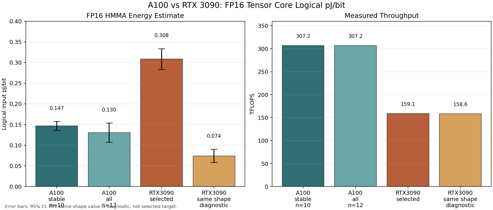
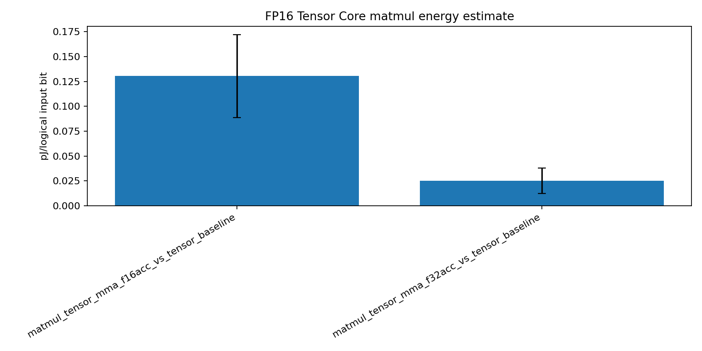
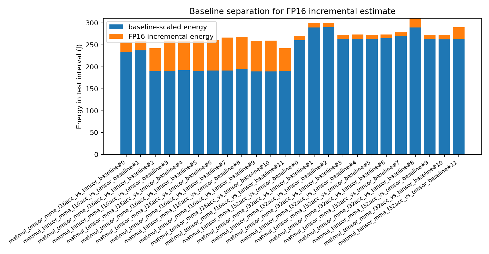
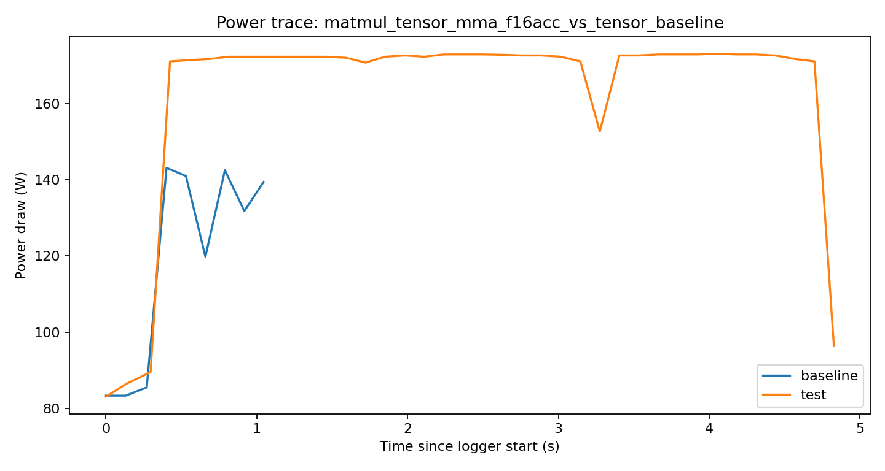
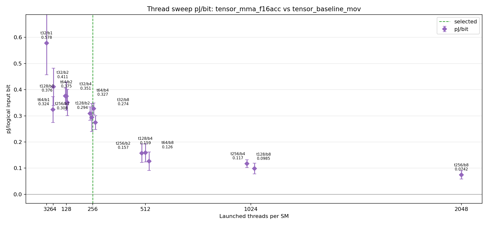

# A100 FP16 Tensor Core pJ/bit 실험 보고서

작성일: 2026-06-03  
결과 디렉터리: `results/fp16_matmul_pjbit_a100_20260603_031033`  
대상 GPU: NVIDIA A100-SXM4-80GB, GA100, `sm_80`

## 1. 요약

이번 실험은 기존 RTX 3090에서 수행했던 FP16 Tensor Core energy 실험을 A100에서 같은 logical HMMA 기준으로 반복한 것이다. 측정값은 DRAM pJ/bit이 아니라, `tensor_mma_f16acc` 커널에서 `tensor_baseline_mov` baseline을 뺀 뒤 logical `m16n16k16` FP16 input bit 수로 나눈 board/NVML energy estimate이다.

A100 5초 이상 launch-shape sweep을 추가로 수행한 뒤에는 아래 값을 우선 사용한다.

| 항목 | 값 |
|---|---:|
| 권장 diagnostic 대표값 | `0.1144 +/- 0.0047 pJ/bit` |
| 대표 launch shape | `threads=384`, `blocks/SM=4` |
| 선택 기준 | quality-gate first saturation point |
| 최저 평균 diagnostic point | `0.1084 +/- 0.0054 pJ/bit`, `threads=384`, `blocks/SM=8` |
| 기존 fixed launch 재측정 | `0.1099 +/- 0.0073 pJ/bit`, `threads=256`, `blocks/SM=8` |
| 전체 test/baseline 최소 elapsed | test `5.878 s`, baseline `5.353 s` |
| 결과 디렉터리 | `results/fp16_long_sweep_a100_20260603_034822` |

아래의 기존 fixed-condition 결과는 short-window 기록으로 남긴다. 이 값은 `iters=1,000,000`에서 test가 약 `1.47 s`, baseline이 약 `0.43 s`였기 때문에, 최종 비교에는 5초 이상 sweep 결과가 더 적합하다.

| 항목 | 기존 fixed-condition 값 |
|---|---:|
| 대표값 | `0.1469 +/- 0.0109 pJ/bit` |
| 전체 12회 평균 | `0.1304 +/- 0.0235 pJ/bit` |
| 안정 구간 median | `0.1529 pJ/bit` |
| 평균 처리율 | `307.23 TFLOPS` |
| 평균 incremental power | `45.12 W` |
| 평균 incremental energy | `66.54 J` |
| SM clock | `1410 MHz`, span `0 MHz` |
| Energy source | `NVML total energy counter` |

초기 2회는 baseline subtraction이 낮게 튄 cold-start 성격의 outlier로 보인다. 기존 fixed-condition 값은 마지막 10회 안정 구간의 평균과 95% CI를 기록한 것이다.



## 2. 배경

이 실험의 목적은 AccelWattch-style analytical GPU power model에 넣을 FP16 Tensor Core 계수의 실측 anchor를 얻는 것이다. GPU 전체 전력만 보면 어떤 연산이 얼마의 동적 에너지를 유발했는지 분리하기 어렵기 때문에, 같은 launch 구조에서 FP16 HMMA가 있는 test kernel과 HMMA가 없는 structural baseline kernel을 각각 실행하고 그 차이를 본다.

현재 측정 경계는 다음과 같다.

```text
pJ/bit = (E_test - P_baseline * elapsed_test) / logical_FP16_input_bits
```

Tensor Core matmul denominator는 logical `m16n16k16`이다.

```text
A bits + B bits = (16*16 + 16*16) * 16 = 8192 bit / logical MMA
FLOPs          = 2 * 16 * 16 * 16       = 8192 FLOP / logical MMA
```

따라서 이 값은 HBM/DRAM bit energy도, register-file bit energy도, FP16 arithmetic unit만의 물리적 절대 에너지도 아니다. 더 정확한 표현은 `logical m16n16k16 FP16 input bit당 baseline-subtracted board/NVML energy estimate`이다.


### 2.1 실험을 쉽게 풀어서 설명

이 실험은 한 문장으로 말하면 **A100 Tensor Core가 FP16 HMMA 연산을 할 때, logical FP16 input bit 하나당 추가로 들어간 에너지가 얼마인지 추정하는 실험**이다. 여기서 중요한 단어는 `추가로`와 `logical`이다.

GPU는 아무 연산을 하지 않아도 전력을 쓴다. clock, control logic, memory refresh, driver/runtime activity, 전원부, leakage 등이 모두 기본 전력에 포함된다. 그래서 단순히 `FP16 커널을 실행했을 때 GPU가 쓴 전체 에너지`를 bit 수로 나누면 FP16 연산의 비용이 아니라, GPU가 켜져 있던 비용과 launch overhead까지 섞인 값이 된다.

이를 줄이기 위해 실험은 거의 같은 모양의 두 커널을 비교한다.

| 커널 | 하는 일 | 목적 |
|---|---|---|
| `tensor_mma_f16acc` | FP16 Tensor Core HMMA를 반복 실행 | 실제 측정하고 싶은 workload |
| `tensor_baseline_mov` | 같은 launch/warp-sync/register 움직임을 유지하되 HMMA는 실행하지 않음 | HMMA가 아닌 기본 비용 추정 |

즉, test kernel에는 `기본 비용 + HMMA 비용`이 들어 있고, baseline kernel에는 최대한 비슷한 `기본 비용`만 들어 있다고 본다. 그래서 test에서 baseline을 빼면 HMMA가 추가로 만든 에너지에 가까워진다.


계산 흐름은 다음과 같다.

1. A100에서 `tensor_baseline_mov`를 실행한다.
2. 실행 시작/끝의 `NVML total energy counter`를 읽어 baseline energy를 얻는다.
3. baseline 실행 시간으로 나누어 baseline 평균 power를 구한다.
4. A100에서 `tensor_mma_f16acc`를 실행한다.
5. 같은 방식으로 test energy와 test 실행 시간을 얻는다.
6. baseline 평균 power를 test 실행 시간에 맞게 scale한다.
7. `test energy - scaled baseline energy`를 계산한다.
8. 이 incremental energy를 logical FP16 input bit 수로 나눈다.

수식으로 쓰면 다음과 같다.

```text
P_baseline = E_baseline / t_baseline
E_incremental = E_test - P_baseline * t_test
pJ/bit = E_incremental / logical_FP16_input_bits * 1e12
```

아래 그림은 이 subtraction이 어떤 의미인지 보여준다. test total energy 전체를 FP16 비용으로 보면 안 되고, baseline으로 설명되는 부분을 먼저 제거해야 한다.


### 2.2 왜 logical bit인가

이 실험에서 bit 수는 GPU memory에서 실제로 읽은 DRAM bit 수가 아니다. benchmark는 timed loop 안에서 의도적인 global memory load/store를 하지 않도록 만들어져 있다. 우리가 나누는 bit 수는 Tensor Core HMMA가 논리적으로 소비하는 matrix operand bit 수다.

logical `m16n16k16` MMA 하나를 생각하면 A matrix 조각과 B matrix 조각의 FP16 input은 다음과 같다.

```text
A operand = 16 * 16 FP16 values
B operand = 16 * 16 FP16 values
FP16 value = 16 bit
logical input bits = (16*16 + 16*16) * 16 = 8192 bit
```

같은 logical MMA 하나가 수행하는 FLOP 수도 `8192 FLOP`이다.

```text
FLOPs = 2 * M * N * K = 2 * 16 * 16 * 16 = 8192 FLOP
```

따라서 이번 결과의 `pJ/bit`은 다음처럼 읽어야 한다.

```text
logical m16n16k16 FP16 input bit당 baseline-subtracted board/NVML energy estimate
```

즉 다음 값들과는 다르다.

| 아님 | 이유 |
|---|---|
| DRAM pJ/bit | timed kernel이 DRAM streaming workload가 아님 |
| L2 pJ/bit | L2 traffic counter validation이 필요하지만 현재 NCU가 막힘 |
| register-file pJ/bit | register read/write bit 수와 물리 에너지를 직접 분리한 실험이 아님 |
| FP16 arithmetic unit의 순수 silicon energy | NVML은 board/GPU-level energy counter임 |

### 2.3 왜 반복하고 안정 구간을 따로 보았나

baseline subtraction은 두 큰 값을 빼서 작은 차이를 얻는 방식이다. 따라서 초반 power state settling, clock/power management, thermal state, sampling window mismatch가 있으면 결과가 낮게 또는 높게 튈 수 있다.

이번 A100 run에서는 총 12개 pair를 얻었다. 전체 평균은 `0.1304 +/- 0.0235 pJ/bit`이지만, 처음 2개 pair가 낮게 튀었다. 처리율과 clock 자체는 정상이라 kernel 실패라기보다는 baseline subtraction 초기 편차로 보는 것이 맞다. 그래서 보고 대표값은 마지막 10개 안정 구간의 평균인 `0.1469 +/- 0.0109 pJ/bit`을 사용했다.

쉽게 말하면, 처음 몇 번은 GPU의 전력 상태가 완전히 같은 조건으로 자리잡기 전이라 baseline을 빼는 계산이 흔들렸고, 이후 반복에서는 값이 더 일관되게 모였다.


### 2.4 Sweep 업데이트: 5초 이상 launch-shape sweep

기존 A100 대표값은 `threads=256`, `blocks/SM=8`, `iters=1,000,000`, `unroll=8`로 고정한 fixed-condition 반복 실험이었다. 이 run은 kernel path와 NVML energy counter 동작을 확인하기에는 충분했지만, test elapsed가 약 `1.47 s`, baseline elapsed가 약 `0.43 s`라서 baseline 평균 power와 power API sampling window mismatch에 취약했다.

이를 보완하기 위해 별도 long-sweep 실험을 수행했다.

| 항목 | 설정 |
|---|---:|
| 결과 디렉터리 | `results/fp16_long_sweep_a100_20260603_034822` |
| Test kernel | `tensor_mma_f16acc` |
| Baseline kernel | `tensor_baseline_mov` |
| Threads/block sweep | `128`, `256`, `384` |
| Blocks/SM sweep | `1`, `2`, `4`, `8` |
| 총 launch shapes | 12 |
| `unroll` | 8 |
| baseline repeats | 10 |
| sample interval | 100 ms |
| 전체 test elapsed minimum | `5.878 s` |
| 전체 baseline elapsed minimum | `5.353 s` |
| 최소 power samples | test `45`, baseline `41` |

각 launch shape의 `iters`는 test가 대략 5.9초가 되도록 조정했고, baseline은 `repeats=10`으로 누적 측정 시간을 늘렸다. 이후 decision에 중요한 `t256_b8`, `t384_b4`, `t384_b8` 조건은 각각 총 5회가 되도록 추가 반복했다.


최종 long-sweep 결과는 다음과 같다.

| 기준 | Launch shape | 반복 | pJ/bit | 해석 |
|---|---:|---:|---:|---|
| Quality-gate selected | `t384_b4` | 5 | `0.1144 +/- 0.0047` | Tensor model utilization first saturation point |
| Lowest mean | `t384_b8` | 5 | `0.1084 +/- 0.0054` | 더 큰 resident work point, selected target은 아님 |
| 기존 fixed launch 재측정 | `t256_b8` | 5 | `0.1099 +/- 0.0073` | 1,000,000회 fixed run의 launch shape를 5초 이상으로 재측정 |

따라서 `1,000,000 iterations`는 A100 FP16 Tensor Core path 확인에는 충분했지만, 최종 비교용 baseline-subtracted pJ/bit 값으로는 짧았다. A100과 RTX3090 비교에는 5초 이상 long-sweep의 quality-gate selected 값 `0.1144 +/- 0.0047 pJ/bit`을 우선 사용한다.

상세 보고서는 다음 파일에 따로 기록했다.

```text
results/fp16_long_sweep_a100_20260603_034822/A100_FP16_LONG5S_SWEEP_REPORT.md
```

### 2.6 이 실험이 확인한 것과 확인하지 못한 것

이번 실험이 확인한 것은 다음이다.

| 확인 항목 | 상태 |
|---|---|
| A100에서 `sm_80` binary 실행 | 확인됨 |
| FP16 HMMA test와 structural baseline 실행 | 확인됨 |
| NVML total energy counter로 test/baseline energy 측정 | 확인됨 |
| logical `m16n16k16` denominator metadata | 확인됨 |
| timed kernel에서 의도된 global/L2 memory operation 없음 | benchmark metadata로 확인됨 |
| clock/temperature 안정성 | 확인됨 |

반대로 아직 확인하지 못한 것은 다음이다.

| 미확인 항목 | 이유 |
|---|---|
| 실제 L2/DRAM traffic counter가 0에 가까운지 | NCU performance counter가 vast.ai에서 `ERR_NVGPUCTRPERM`으로 막힘 |
| HMMA instruction/activity counter evidence | NCU counter 접근 불가 |
| local spill counter evidence | NCU counter 접근 불가 |

따라서 이번 결과는 실행과 NVML energy 측정 관점에서는 정상적인 A100 diagnostic result이지만, strict NCU-validated final claim은 아니다.

## 3. 실험 설계

실험 matrix는 `configs/fp16_matmul_pjbit_matrix.json`을 사용했다.

| 구분 | 설정 |
|---|---|
| Test kernel | `tensor_mma_f16acc` |
| Baseline kernel | `tensor_baseline_mov` |
| CUDA arch | `sm_80` |
| Blocks | `0`, 런타임에서 `SM count * blocks_per_sm`로 설정 |
| SM count | 108 |
| Blocks/SM | 8 |
| Threads/block | 256 |
| Threads/SM | 2048 |
| Iterations | 1,000,000 |
| Unroll | 8 |
| Output store | `--suppress-output-store` |
| Repeats | 최초 7회 + 추가 5회, 총 12 pair |

`tensor_baseline_mov`는 Tensor kernel과 같은 warp-sync/register movement 구조를 유지하되 HMMA를 수행하지 않는 baseline이다. test와 baseline 모두 timed loop 내부에서 의도적인 global/L2 memory operation을 하지 않도록 metadata를 기록하고 `suppress_output_store`를 사용했다.

## 4. Power Measurement API 주의사항

A100과 H100은 `power.draw`, `power.draw.average`, `power.draw.instant`처럼 같은 이름의 power measurement API를 노출할 수 있다. 그러나 이름이 같다고 해서 측정 window, 업데이트 주기, smoothing, instantaneous/average semantics가 같다고 가정하면 안 된다. 특히 H100/GH100 계열은 NVML field API와 power smoothing 동작이 Ampere와 다를 수 있고, Hopper는 아키텍처 자체도 다르다.

이번 A100 분석에서는 다음 원칙을 적용했다.

1. `nvidia-smi` power trace 적분값은 primary energy로 쓰지 않았다.
2. benchmark timed interval 안에서 읽은 `NVML total energy counter` delta를 primary energy source로 사용했다.
3. `power.draw.average/instant` trace는 sanity cross-check로만 사용했다.
4. counter/trace ratio가 완전히 1이 아니어도 곧바로 실패로 보지 않았다. 같은 API 이름이라도 trace sample window가 timed kernel interval과 정확히 정렬되지 않기 때문이다.

A100 안정 구간에서 counter/trace ratio는 test 평균 `1.007`, baseline 평균 `0.945`였다. RTX3090 selected diagnostic에서는 test `0.952`, baseline `0.970`이었다.

## 5. A100 결과

A100의 마지막 10회 안정 구간 결과는 `0.1469 +/- 0.0109 pJ/bit`이다. 처리율은 `307.23 TFLOPS`로 A100 SXM dense FP16 Tensor Core reference peak에 매우 가깝다. Tensor model utilization은 약 98.5% 수준으로, 커널은 Tensor Core path를 충분히 포화한 것으로 해석된다.



Energy separation plot을 보면 test energy의 대부분은 baseline-scaled energy이고, incremental HMMA 성분은 안정 구간에서 평균 약 25.7%이다. 이 비율이 너무 작으면 baseline subtraction noise에 취약하지만, 이번 안정 구간은 quality gate의 최소 incremental fraction 기준을 넘는다.



아래는 마지막 pair의 power trace 예시다. Power trace는 sanity plot이며, 최종 에너지 계산은 timed NVML energy counter를 사용했다.



## 6. RTX 3090 비교

기존 RTX3090 결과 중 가장 의미 있는 비교점은 `strict_fp16_launch_shape_rtx3090_20260602_115550`의 quality-gate selected target이다.

| GPU / 조건 | Launch shape | TFLOPS | pJ/bit | 해석 |
|---|---:|---:|---:|---|
| A100 안정 구간 | `threads=256`, `blocks/SM=8` | `307.23` | `0.1469 +/- 0.0109` | 이번 A100 대표값 |
| A100 전체 12회 | `threads=256`, `blocks/SM=8` | `307.22` | `0.1304 +/- 0.0235` | cold-start outlier 포함 |
| RTX3090 selected | `threads=256`, `blocks/SM=1` | `159.15` | `0.3085 +/- 0.0253` | 기존 strict-like selected target |
| RTX3090 same shape | `threads=256`, `blocks/SM=8` | `158.62` | `0.0742 +/- 0.0159` | 같은 launch shape diagnostic, final selected 아님 |

A100 대표값은 RTX3090 selected target과 비교하면 약 `2.1x` 낮은 pJ/bit이다. 반대로 RTX3090의 같은 launch shape diagnostic 값은 더 낮게 보이지만, 이 행은 기존 보고서에서도 final target으로 선택하지 않았다. resident work가 커지면 fixed overhead가 희석되어 pJ/bit가 낮아질 수 있고, NCU validation 없이 no-L2/HMMA evidence를 확정할 수 없기 때문이다.

기존 RTX3090 thread sweep figure는 아래와 같다.



## 7. 차이가 나는 이유

A100과 RTX3090은 둘 다 Ampere 세대지만 같은 아키텍처로 취급하면 안 된다. A100은 GA100 datacenter GPU이고, RTX3090은 GA102 consumer GPU다. 주요 차이는 다음과 같다.

1. A100은 SM 수가 108개로 RTX3090의 82개보다 많고, FP16 Tensor Core dense peak가 훨씬 높다.
2. 이번 A100 run은 `1410 MHz`로 clock span이 `0 MHz`였고, power/thermal 상태가 안정적이었다.
3. A100의 평균 처리율은 `307 TFLOPS`로 RTX3090 selected target의 `159 TFLOPS`보다 약 1.93배 높다.
4. pJ/bit은 incremental energy를 logical input bit으로 나눈 값이므로, 동일한 fixed overhead와 baseline noise가 있을 때 더 높은 useful work 처리량은 낮은 pJ/bit로 나타난다.
5. RTX3090 selected target은 first saturation point인 `blocks/SM=1`을 선택했고, A100 이번 matrix는 `blocks/SM=8` 고정이다. 따라서 두 값은 “동일 launch-shape strict comparison”이라기보다 “기존 RTX3090 selected 기준 대비 A100 fixed matrix 결과”로 읽어야 한다.

H100과 비교할 때는 추가로 주의가 필요하다. H100/GH100은 Hopper이고 WGMMA/TMA가 존재한다. 현재 benchmark는 H100에서도 WGMMA가 아니라 common warp-level HMMA `mma.sync m16n8k16` pair를 쓰는 비교용 경로다. 따라서 H100의 native WGMMA path energy와 직접 비교하면 안 된다.

## 8. 품질과 한계

이번 A100 결과는 다음 조건을 만족했다.

| 항목 | 상태 |
|---|---|
| `tensor_mma_f16acc/tensor_baseline_mov` valid rows | 12/12 |
| Benchmark schema | `fp16-energy-bench-v2` |
| Denominator metadata | complete, `8192 input bits/logical MMA` |
| Energy source | `NVML total energy counter` |
| Clock stability | `1410 MHz`, span `0 MHz` |
| Intended timed global/L2 memory | metadata상 없음 |

그러나 최종 strict claim은 아니다. A100에서도 Nsight Compute permission probe가 `ERR_NVGPUCTRPERM`으로 실패했다.

```text
ncu permission probe failed: Nsight Compute performance counters are blocked by ERR_NVGPUCTRPERM
```

따라서 이번 결과는 hardware counter로 no-L2/no-DRAM/no-local-spill 및 Tensor Core HMMA activity를 증명하지 못한 diagnostic 결과다. 최종 publishable 값으로 쓰려면 performance counter 접근 권한이 열린 환경에서 `quality_gate.py --require-ncu --require-ncu-tensor-activity`를 통과해야 한다.

## 9. 재현 명령

실험 실행:

```bash
cd /workspace/gpupower/fp16_energy_impl
/workspace/gpupower/.venv/bin/python scripts/run_experiment.py \
  --binary build/fp16_energy_bench \
  --matrix configs/fp16_matmul_pjbit_matrix.json \
  --outdir results/fp16_matmul_pjbit_a100_20260603_031033 \
  --gpu 0 \
  --sample-ms 100 \
  --repeat 7

/workspace/gpupower/.venv/bin/python scripts/run_experiment.py \
  --binary build/fp16_energy_bench \
  --matrix configs/fp16_matmul_pjbit_matrix.json \
  --outdir results/fp16_matmul_pjbit_a100_20260603_031033 \
  --gpu 0 \
  --sample-ms 100 \
  --repeat 5 \
  --append
```

분석과 품질 게이트:

```bash
/workspace/gpupower/.venv/bin/python scripts/analyze_results.py \
  --input results/fp16_matmul_pjbit_a100_20260603_031033

/workspace/gpupower/.venv/bin/python scripts/quality_gate.py \
  --input results/fp16_matmul_pjbit_a100_20260603_031033
```

NCU permission probe:

```bash
/workspace/gpupower/.venv/bin/python scripts/probe_ncu_permissions.py \
  --binary build/fp16_energy_bench \
  --outdir results/fp16_matmul_pjbit_a100_20260603_031033/ncu_permission_probe \
  --gpu 0 \
  --threads 256 \
  --blocks-per-sm 8 \
  --iters 100 \
  --unroll 8
```

## 10. 산출물

| 파일 | 내용 |
|---|---|
| `summary.csv` | pair-level 분석 결과 |
| `condition_summary.csv` | condition별 평균/분산/CI 요약 |
| `quality_gates.csv` | row별 quality gate 결과 |
| `quality_gate_summary.json` | quality gate threshold와 summary |
| `runs.jsonl` | raw run metadata |
| `ncu_permission_probe/` | NCU permission probe 실패 evidence |
| `figures/` | pJ/bit, energy separation, trace, comparison plot |

## 11. 결론

5초 이상 launch-shape sweep을 반영하면, A100 FP16 Tensor Core HMMA logical input 기준 권장 diagnostic 값은 quality-gate selected 기준 `0.1144 +/- 0.0047 pJ/bit`이다. 최저 평균 point는 `0.1084 +/- 0.0054 pJ/bit`이지만, 더 큰 resident work point라서 selected 대표값으로는 쓰지 않는다. 기존 fixed-condition 안정 구간 값 `0.1469 +/- 0.0109 pJ/bit`은 short-window diagnostic 기록으로 남긴다.

기존 RTX3090 selected diagnostic 값 `0.3085 +/- 0.0253 pJ/bit`과 비교하면 A100 long-sweep selected 값은 약 2.7배 낮다. 이는 GA100의 더 높은 Tensor Core throughput, datacenter GPU의 안정적인 clock/power behavior, 그리고 5초 이상 측정으로 fixed overhead와 sampling-window mismatch가 줄어든 효과가 결합된 결과로 해석된다.

다만 이번 값도 NCU hardware counter validation이 없는 diagnostic 값이다. 같은 API 이름을 쓰는 H100과도 power telemetry semantics 및 아키텍처가 다르므로, H100 비교는 별도 strict run에서 HMMA/WGMMA 경로와 NVML field behavior를 명확히 분리해야 한다.

## 부록 A. Vast.ai NCU 제한 및 검수 업데이트

추가 검수 시점에 sudo/root로 NCU permission probe를 직접 재실행했지만, vast.ai 컨테이너 권한 제한으로 `ERR_NVGPUCTRPERM`이 계속 발생했다. 컨테이너 내부 사용자는 `uid=0(root)`이지만 effective capability에 `CAP_SYS_ADMIN`이 없고, NVIDIA driver parameter는 `RmProfilingAdminOnly: 1`이다. 따라서 NCU는 benchmark process에 attach까지는 성공하지만 GPU performance counter 접근에서 실패한다.

```text
==PROF== Connected to process .../build/fp16_energy_bench
==ERROR== ERR_NVGPUCTRPERM - The user does not have permission to access NVIDIA GPU Performance Counters
==PROF== Disconnected
```

이 제한 때문에 현재 환경에서는 HMMA activity, L2 bytes, DRAM bytes, local spill counter evidence를 만들 수 없다. 따라서 본 보고서의 A100 수치는 `NVML total energy counter 기반 diagnostic estimate`로 해석해야 하며, strict NCU-validated claim은 아니다.

실험 실행 자체에 대한 별도 검수 결과는 다음 파일에 기록했다.

```text
results/fp16_matmul_pjbit_a100_20260603_031033/A100_FP16_PJBIT_AUDIT.md
```

검수 결론은 다음과 같다.

| 항목 | 판정 |
|---|---|
| A100 `sm_80` build/run | PASS |
| raw run completeness | PASS, 48/48 |
| f16acc pair quality | PASS, 12/12 |
| schema/denominator metadata | PASS |
| intended timed global/L2 memory metadata | PASS, no intended memory |
| NVML total energy counter | PASS, 48/48 positive |
| clock/thermal stability | PASS |
| NCU hardware counter validation | BLOCKED by vast.ai permission |
